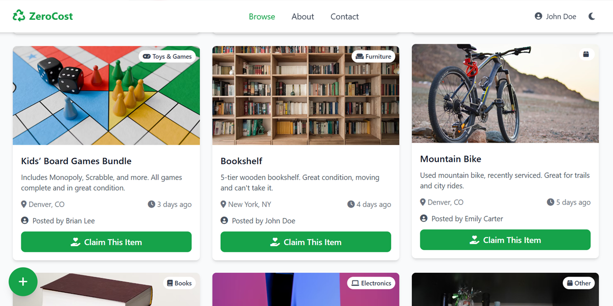

# ZeroCost

Community-driven platform for free item sharing  
Reduce waste and help others by giving and taking items for free


ZeroCost is a platform where users can post free listings of items they want to give away, browse items offered by others, and claim what they need. The goal is to foster a sharing community, reduce waste, and support sustainability.



## Features

- **Home**: Browse free listings with search and filter options  
- **User Profiles**: Manage your shared items and claims  
- **Add Listings**: Easily post items you want to give away  
- **Community Interaction**: User setup, notifications, and engagement  
- **Responsive UI**: Clean and modern design powered by React and Tailwind CSS  

## Getting Started

### Prerequisites

- Node.js (v14 or higher)  
- npm or yarn  

### Installation & Running

#### Local Setup

Clone the repository:
Clone the repository:

```bash
git clone https://github.com/your-username/zero-cost.git
cd zero-cost
```

Install dependencies:

```bash
npm install
```

Start the development server:

```bash
npm run dev
```

Open http://localhost:3000 in your browser.


### Production & Deployment

Build for production
```bash
npm run build
```

The build output will be generated in the dist folder, ready to deploy to any static web server.

### Deploy to GitHub Pages

The app is configured to run in the /zero-cost/ subfolder.


## Contributing

Contributions are what make the open source community such an amazing place to learn, inspire, and create. Any contributions you make are greatly appreciated.

Fork the repository

Create a feature branch:

```bash
git checkout -b feature/YourFeature
```

Commit your changes:

```bash
git commit -m "Add your feature description"
```

Push the branch:

```bash
git push origin feature/YourFeature
```

Open a pull request on GitHub.


## Acknowledgements

- **React** — for the powerful UI framework \n
- **Tailwind CSS** — for flexible, fast styling
- **React Router** — for client-side routing
- **FontAwesome** — for icons


## License

This project is licensed under the MIT License - see the LICENSE file for details.

MIT © 2025 ZeroCost
See [LICENSE](./LICENSE) for details.

